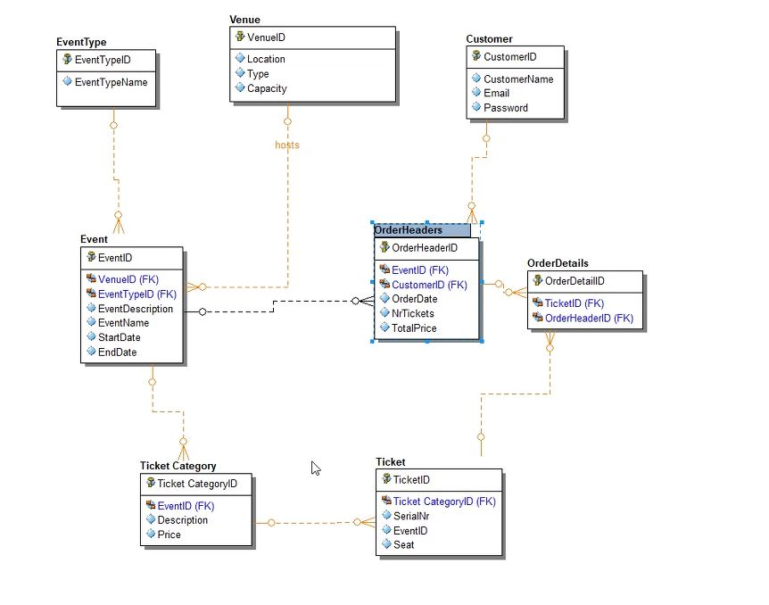

# Install
npm install

# Start
npm run dev

# Check browser console

# Ticket Management System

Film Ticket Management Application

## Description

This project represents the frontend part of a film ticket management application. The application allows users to view events, add new events, make orders, filter events, and much more.

## Features

- Displaying events in a card format on the user interface.
- Adding new events through POST requests to the backend.
- Resetting the card to its initial values after adding an event.
- Displaying user orders on the "Orders" page.
- Handling errors and Toast notifications for API calls.
- Implementing a custom loader.
- Real-time or button-based event filtering.
- Filtering events by name, location, and event type using the backend API.
- Updating and deleting orders.

